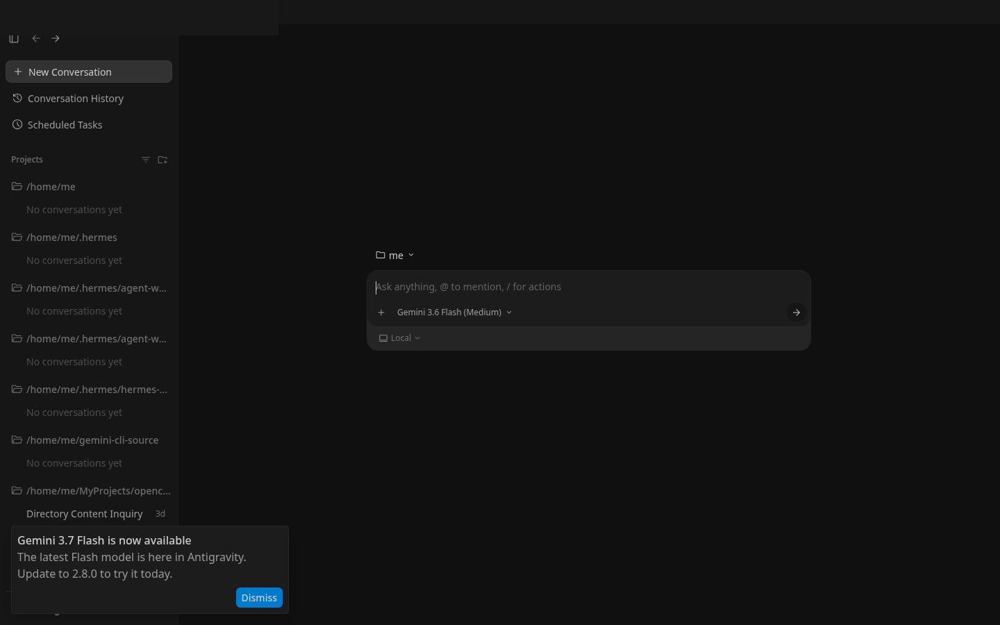
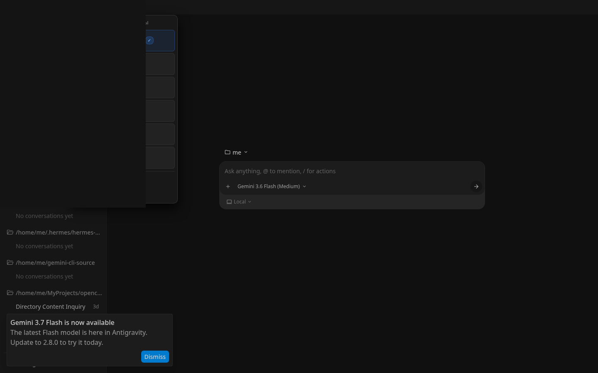
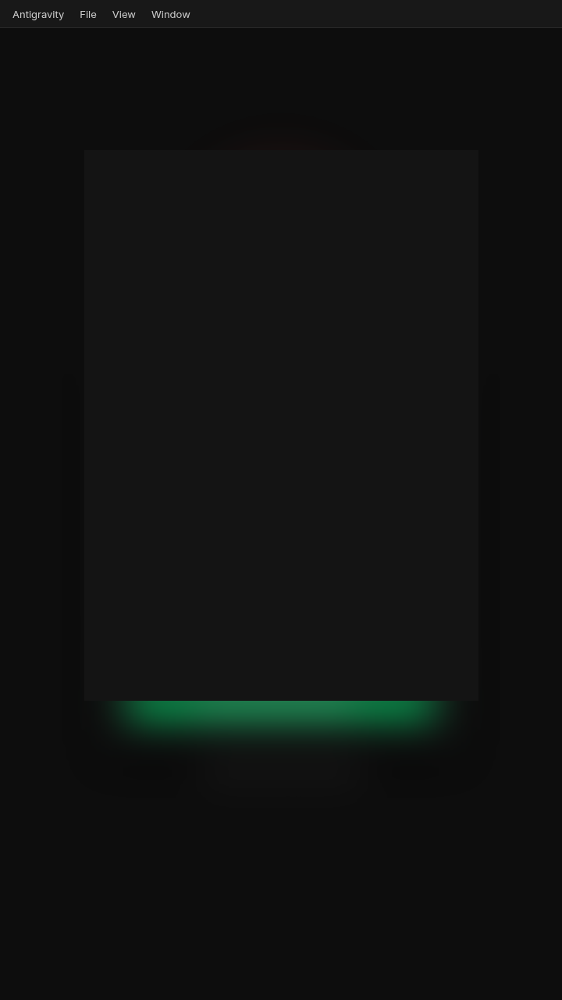
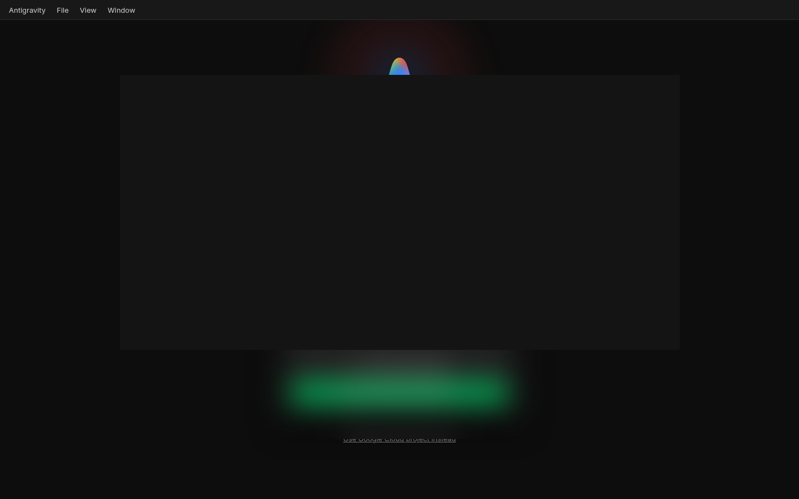

# 🚀 Antigravity Web IDE & Multi-Account Suite

**Antigravity Web** — автономный веб-сервер и полнофункциональная веб-версия **Google Antigravity IDE (v2.6.0)** с поддержкой переключения между несколькими аккаунтами Google, защищённой авторизацией через Nginx и автоматической синхронизацией токенов.

---

## 🖼️ Скриншоты веб-интерфейса

### 🖥️ Интерфейс Web IDE (Desktop)


### 🔑 Выпадающее меню переключения аккаунтов (Top Navbar)


### 📱 Мобильная развертка (720x1280 Viewport)


### 🔐 Менеджер аккаунтов и Google OAuth (`/login`)


---

## ✨ Ключевые возможности

- 🌐 **Web IDE Antigravity:** Полноценный интерфейс Antigravity в вашем браузере (SSL / HTTPS + Basic Auth).
- 🔑 **Multi-Account Manager:** Бесшовное переключение между несколькими аккаунтами Google через верхнее меню `Accounts`.
- ⚡ **Анимированные индикаторы и прогресс-бары:** Интерактивное отображение статуса активации аккаунтов и перезапуска сервера.
- 🛠️ **Синхронизация токенов:** Автоматическое обновление токенов OAuth, запись в Linux SecretService Keyring и SQLite БД `state.vscdb`.
- 📡 **Авто-реконнект gRPC-стримов:** Подавление служебного шума консоли при переподключении каналов `reconnectableStream`.
- 🔐 **Страница `/login`:** Авторизация аккаунтов Google с генерацией OAuth URL и автоматическим перенаправлением при истечении сессии.

---

## 🛠️ Архитектура системы

```text
[ Browser / Client ] (HTTPS :9443)
        │
        ▼
[ Nginx / OpenResty ] Reverse Proxy
   ├── /login & static resources ──────► /usr/local/openresty/nginx/html/ (login.html, polyfill.js)
   ├── /auth-api/ (Multi-Account API) ─► Node.js Auth Server (http://127.0.0.1:8088)
   └── / (Web IDE & gRPC-Web Streams) ─► Antigravity Language Server (http://127.0.0.1:8085 / :9000)
```

---

## 📡 Документация API

Полная спецификация REST API и gRPC-Web эндпоинтов доступна в файле **[API.md](API.md)**.

---

## 🚀 Быстрый старт

### 1. Установка и развертывание

```bash
git clone https://github.com/LevRa7/Antigravity-web.git
cd Antigravity-web
bash scripts/setup.sh
```

### 2. Управление службами

```bash
# Перезапуск всех служб
npm run restart

# Запуск REST API сервера мульти-аккаунтности вручную
npm start
```

---

## 📜 Структура проекта

- `web/login.html` — Страница управления аккаунтами и Google OAuth.
- `web/polyfill.js` — Нативные мосты браузера, меню `Accounts`, обработка ошибок и лог-фильтры.
- `scripts/auth_server.js` — REST API сервер мульти-аккаунтности (порт 8088).
- `src/account_manager.js` — Библиотека работы с аккаунтами, токенами, Keyring и SQLite.
- `src/keyring_helper.py` — Вспомогательный скрипт Linux SecretService / DBus.
- `config/nginx.conf` — Конфигурация обратного прокси Nginx.
- `config/systemd/` — Юниты Systemd для фонового автозапуска (`antigravity-server`, `antigravity-auth-server`).
- `docs/screenshots/` — Скриншоты веб-интерфейса IDE и мобильной развертки.

---

## 📄 Лицензия

MIT License © 2026 LevRa7
